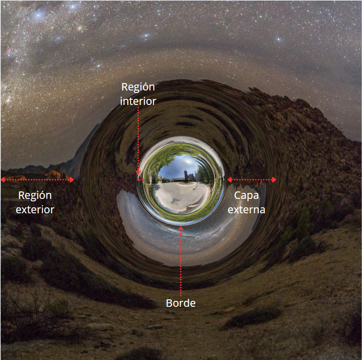

# 🌌 Simulación de un Agujero de Gusano de Morris-Thorne en Tiempo Real

Este repositorio contiene el código y la implementación de un simulador relativista en tiempo real de un agujero de gusano transitable, utilizando la métrica propuesta por Michael Morris y Kip Thorne en 1988. 

El simulador ha sido desarrollado en **Unity 6** empleando shaders personalizados (HLSL) para resolver numéricamente las geodésicas nulas que describen la trayectoria de la luz en un espacio-tiempo curvo.

---

## 🔗 Enlaces del Proyecto

*   **💻 Simulador Interactivo (Web):** [Visitar el sitio web del simulador](https://alvaroperez02.github.io/simulacion-agujero-gusano/)
*   **📄 Memoria del Trabajo (PDF):** [Descargar PDF en la sección de Releases](https://github.com/alvaroperez02/simulacion-agujero-gusano/releases)
*   **📦 Versión de Escritorio para Windows:** [Descargar ejecutable (.zip)](https://github.com/alvaroperez02/simulacion-agujero-gusano/releases)

---

## 📸 Demostración Visual

A continuación se muestran algunas representaciones de los fenómenos físicos simulados:

### Lente Gravitacional en la Garganta
La extrema curvatura del espacio-tiempo desvía la trayectoria de los rayos de luz de fondo, generando distorsiones visuales muy pronunciadas en las proximidades de la garganta.

  

### Diagrama de Embebimiento de Morris-Thorne
Representación de la hipersuperficie bidimensional de la garganta incrustada en un espacio euclídeo tridimensional, obtenida a partir de la integración de la métrica.

  

---

## 📐 Fundamento Físico

La métrica de Morris-Thorne describe un agujero de gusano estático y con simetría esférica que conecta dos regiones asintóticamente planas (los universos $l > 0$ y $l < 0$):

$$ds^2 = -c^2 dt^2 + dl^2 + (b_0^2 + l^2)(d\theta^2 + \sin^2\theta d\phi^2)$$

Donde $b_0$ es el radio de la garganta en el punto de transición ($l=0$). En la simulación se resuelven numéricamente las geodésicas nulas mediante un algoritmo de **Runge-Kutta de 4º orden (RK4)** integrado en la GPU para procesar los rayos de luz por cada píxel de la pantalla.

---

## 🛠️ Tecnologías Utilizadas

*   **Motor Gráfico:** Unity 6
*   **Lenguajes de programación:** C# (control de cámara e interacciones) y HLSL/Cg (trazado de rayos y cálculo relativista)
*   **Análisis matemático previo:** Python (con librerías `numpy` y `matplotlib`)
